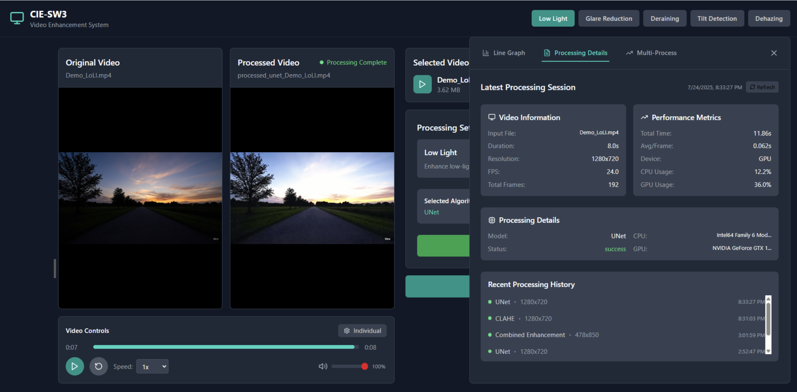
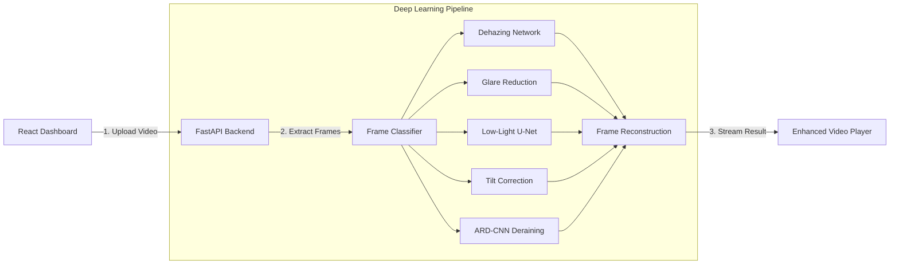

# Vision Edge: Video Enhancement Platform

[](https://pytorch.org/)
[](https://fastapi.tiangolo.com/)
[](https://reactjs.org/)
[](https://www.docker.com/)

> **Advanced AI/ML Video Processing Pipeline for Environmental and Operational Degradation**



---

## Project Overview

Vision Edge is a comprehensive video enhancement platform designed to restore poor-quality footage for critical applications like security surveillance, traffic monitoring, and autonomous navigation. 

Real-world visual data is frequently compromised by environmental factors (haze, rain) and operational limitations (low lighting, lens glare, camera tilt). This platform utilizes advanced deep learning architectures—including U-Net and ARD-CNN—to systematically process, reconstruct, and enhance degraded video frames, transforming unusable footage into high-fidelity data.

---

## Key Processing Modules

* **Low-Light Enhancement:** Utilizes CLAHE and U-Net architectures to intelligently classify low-light frames and enhance visibility without overexposing natural light sources.
* **Raindrop Removal (ARD-CNN):** Employs an Attentive Recurrent Network to generate binary masks for raindrop detection, followed by an inpainting model to restore the occluded background.
* **Glare Reduction:** Segments enhanced frames to identify high-intensity regions, applying dynamic thresholds to suppress light glare and lens flares using the Flare7K dataset.
* **Tilt Detection & Correction:** Applies ORB & BRIEF algorithms to detect keypoints and match deviations between consecutive frames, mathematically identifying and correcting camera tilt.
* **Dehazing:** Extracts features through a 5-layer convolutional network, computing a transformation map to reconstruct clean, haze-free imagery.

---

## Architecture & Data Flow

## Tech Stack

* **Machine Learning:** PyTorch, OpenCV, BasicSR, Scikit-Image
* **Backend:** Python, FastAPI, Uvicorn
* **Frontend:** React, Tailwind CSS
* **Infrastructure:** Docker, NVIDIA CUDA 12

---

## Project Structure

```text
SW3_computer_vision/
├── backend/                  # FastAPI Server & ML Models
│   ├── app/
│   │   ├── main.py           # Core API Endpoints
│   │   └── basicsr/          # U-Net, VGG, and Dataset loaders
│   ├── Dockerfile
│   └── requirements.txt
├── frontend/                 # React UI
│   ├── src/
│   └── package.json
├── RaindropRemoval/          # Specialized ARD-CNN Pipeline
│   ├── test_ardcnn.py
│   └── model/
├── dataset/                  # Input mount for local processing
├── output/                   # Output mount for enhanced videos
└── run.sh                    # Automation script for local/docker execution
```

---

## Getting Started

The platform utilizes Docker to manage complex PyTorch and CUDA dependencies, ensuring a stable environment for GPU acceleration.

### Prerequisites
* [Docker Desktop](https://www.docker.com/products/docker-desktop/) 
* NVIDIA GPU with CUDA support (Recommended for processing speed)
* [Node.js](https://nodejs.org/) (For local frontend development)

### Running the Application

**1. Start the FastAPI Backend (Dockerized)**
Navigate to the root directory and use the provided shell script to build the CUDA image and run the ARD-CNN pipeline:
```bash
chmod +x run.sh
./run.sh
```
*The API will be available at `http://localhost:8000`.*

**2. Start the React Frontend**
Open a new terminal, navigate to the frontend directory, and start the development server:
```bash
cd frontend
npm install
npm start
```
*The dashboard will be accessible at `http://localhost:3000`.*

---

## Contributors

Developed by the Vision Edge Team:
Amogh Varsh, Ankita Anand, Prajwal M Kashyap, Priyanshu Kumar, Rishabh Jawagal, Rishi D V, Sanjay D M, **Swapnil Kumar**

---
